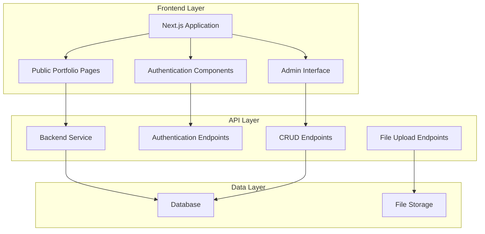
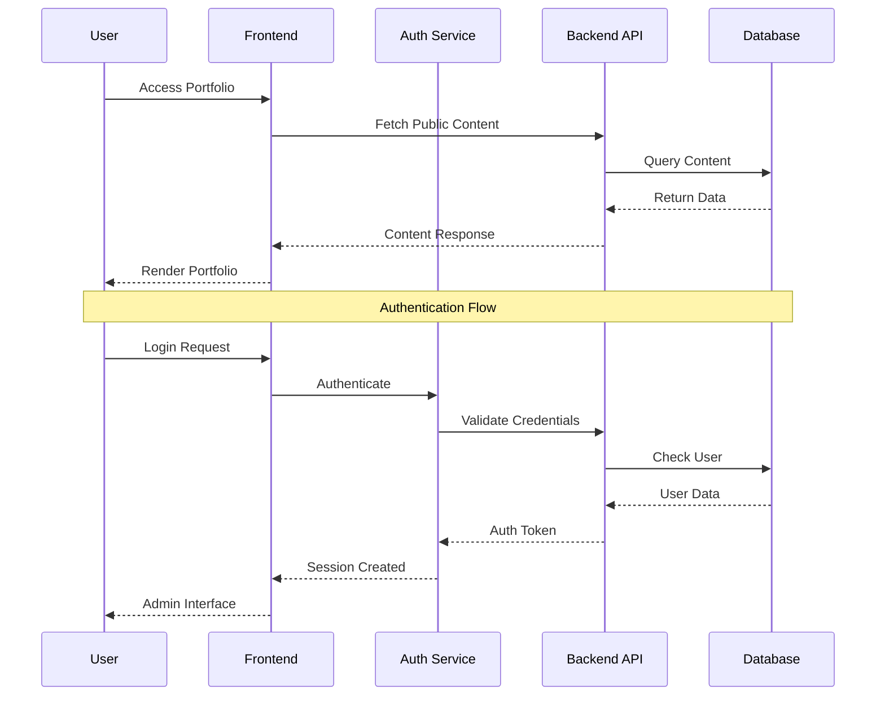

# Design Document

## Overview

This design document outlines the technical architecture for transforming a static Next.js portfolio website into a dynamic, database-driven platform with authentication capabilities. The system will integrate with an existing backend service at https://portifolio-backend-ptck.onrender.com to provide CRUD operations for portfolio content while maintaining public read access.

### Key Design Goals

- **Seamless Integration**: Enhance existing components without breaking current functionality
- **Security First**: Implement robust authentication and authorization mechanisms
- **Performance Preservation**: Maintain current page load speeds for public visitors
- **Developer Experience**: Provide intuitive admin interfaces for content management
- **Data Integrity**: Ensure reliable data validation and synchronization

### System Boundaries

The system encompasses:
- Next.js frontend application with existing portfolio components
- Authentication service integration
- Database layer for content persistence
- API layer for CRUD operations
- Admin interface components for content management

External dependencies:
- Backend service at https://portifolio-backend-ptck.onrender.com
- Database system (managed by backend service)
- Image hosting service for project assets

## Architecture

### High-Level Architecture

The system follows a three-tier architecture pattern:



### Component Integration Strategy

The design preserves existing components while adding new capabilities:

**Enhanced Existing Components:**
- `ProjectCard`: Add edit/delete buttons for authenticated users
- `ProjectPreview`: Include admin controls overlay
- `Navbar`: Add login/logout functionality and admin menu
- `Hero`: Add quick edit capabilities for authenticated users

**New Admin Components:**
- `AdminLayout`: Wrapper for authenticated admin pages
- `ProjectForm`: Create/edit form for project entities
- `ContentManager`: Dashboard for managing all content types
- `AuthGuard`: Higher-order component for route protection

### Data Flow Architecture



## Components and Interfaces

### Authentication Components

#### AuthProvider
```typescript
interface AuthContextType {
  user: User | null;
  login: (credentials: LoginCredentials) => Promise<void>;
  logout: () => void;
  isAuthenticated: boolean;
  isLoading: boolean;
}

interface User {
  id: string;
  email: string;
  name: string;
  role: 'admin' | 'owner';
}

interface LoginCredentials {
  email: string;
  password: string;
}
```

#### AuthGuard Component
```typescript
interface AuthGuardProps {
  children: React.ReactNode;
  fallback?: React.ReactNode;
  requireAuth?: boolean;
}
```

### Content Management Components

#### ProjectForm Component
```typescript
interface ProjectFormProps {
  project?: Project;
  onSubmit: (project: ProjectInput) => Promise<void>;
  onCancel: () => void;
  isLoading?: boolean;
}

interface ProjectInput {
  title: string;
  description: string;
  technologies: string[];
  githubUrl?: string;
  liveUrl?: string;
  imageUrl?: string;
  highlights: string[];
  order: number;
}
```

#### ContentManager Component
```typescript
interface ContentManagerProps {
  contentType: 'projects' | 'skills' | 'experience' | 'certificates';
  onContentChange: (content: any[]) => void;
}
```

### Enhanced Existing Components

#### Enhanced ProjectCard
```typescript
interface ProjectCardProps {
  project: Project;
  isEditable?: boolean;
  onEdit?: (project: Project) => void;
  onDelete?: (projectId: string) => void;
}
```

#### Enhanced Navbar
```typescript
interface NavbarProps {
  showAdminMenu?: boolean;
  user?: User;
  onLogout?: () => void;
}
```

### API Service Layer

#### API Client Interface
```typescript
interface ApiClient {
  // Authentication
  login(credentials: LoginCredentials): Promise<AuthResponse>;
  logout(): Promise<void>;
  refreshToken(): Promise<AuthResponse>;
  
  // Projects
  getProjects(): Promise<Project[]>;
  getProject(id: string): Promise<Project>;
  createProject(project: ProjectInput): Promise<Project>;
  updateProject(id: string, project: Partial<ProjectInput>): Promise<Project>;
  deleteProject(id: string): Promise<void>;
  
  // Other content types
  getSkills(): Promise<Skill[]>;
  getExperience(): Promise<Experience[]>;
  getCertificates(): Promise<Certificate[]>;
  
  // File operations
  uploadImage(file: File): Promise<UploadResponse>;
}
```

## Data Models

### Core Entities

#### Project Entity
```typescript
interface Project {
  id: string;
  title: string;
  description: string;
  technologies: string[];
  githubUrl?: string;
  liveUrl?: string;
  imageUrl?: string;
  highlights: string[];
  order: number;
  createdAt: Date;
  updatedAt: Date;
  isPublished: boolean;
}
```

#### Skill Entity
```typescript
interface Skill {
  id: string;
  name: string;
  category: 'frontend' | 'backend' | 'database' | 'tools' | 'other';
  proficiency: number; // 1-100
  yearsOfExperience: number;
  order: number;
  isVisible: boolean;
}
```

#### Experience Entity
```typescript
interface Experience {
  id: string;
  company: string;
  position: string;
  description: string;
  startDate: Date;
  endDate?: Date;
  technologies: string[];
  achievements: string[];
  order: number;
  isVisible: boolean;
}
```

#### Certificate Entity
```typescript
interface Certificate {
  id: string;
  name: string;
  issuer: string;
  issueDate: Date;
  expiryDate?: Date;
  credentialId?: string;
  credentialUrl?: string;
  imageUrl?: string;
  order: number;
  isVisible: boolean;
}
```

### Database Schema Design

```sql
-- Users table for authentication
CREATE TABLE users (
  id UUID PRIMARY KEY DEFAULT gen_random_uuid(),
  email VARCHAR(255) UNIQUE NOT NULL,
  password_hash VARCHAR(255) NOT NULL,
  name VARCHAR(255) NOT NULL,
  role VARCHAR(50) DEFAULT 'owner',
  created_at TIMESTAMP DEFAULT CURRENT_TIMESTAMP,
  updated_at TIMESTAMP DEFAULT CURRENT_TIMESTAMP
);

-- Projects table
CREATE TABLE projects (
  id UUID PRIMARY KEY DEFAULT gen_random_uuid(),
  title VARCHAR(255) NOT NULL,
  description TEXT NOT NULL,
  technologies JSONB NOT NULL DEFAULT '[]',
  github_url VARCHAR(500),
  live_url VARCHAR(500),
  image_url VARCHAR(500),
  highlights JSONB NOT NULL DEFAULT '[]',
  order_index INTEGER NOT NULL DEFAULT 0,
  is_published BOOLEAN DEFAULT true,
  created_at TIMESTAMP DEFAULT CURRENT_TIMESTAMP,
  updated_at TIMESTAMP DEFAULT CURRENT_TIMESTAMP
);

-- Skills table
CREATE TABLE skills (
  id UUID PRIMARY KEY DEFAULT gen_random_uuid(),
  name VARCHAR(255) NOT NULL,
  category VARCHAR(100) NOT NULL,
  proficiency INTEGER CHECK (proficiency >= 1 AND proficiency <= 100),
  years_of_experience INTEGER DEFAULT 0,
  order_index INTEGER NOT NULL DEFAULT 0,
  is_visible BOOLEAN DEFAULT true,
  created_at TIMESTAMP DEFAULT CURRENT_TIMESTAMP,
  updated_at TIMESTAMP DEFAULT CURRENT_TIMESTAMP
);

-- Experience table
CREATE TABLE experience (
  id UUID PRIMARY KEY DEFAULT gen_random_uuid(),
  company VARCHAR(255) NOT NULL,
  position VARCHAR(255) NOT NULL,
  description TEXT,
  start_date DATE NOT NULL,
  end_date DATE,
  technologies JSONB NOT NULL DEFAULT '[]',
  achievements JSONB NOT NULL DEFAULT '[]',
  order_index INTEGER NOT NULL DEFAULT 0,
  is_visible BOOLEAN DEFAULT true,
  created_at TIMESTAMP DEFAULT CURRENT_TIMESTAMP,
  updated_at TIMESTAMP DEFAULT CURRENT_TIMESTAMP
);

-- Certificates table
CREATE TABLE certificates (
  id UUID PRIMARY KEY DEFAULT gen_random_uuid(),
  name VARCHAR(255) NOT NULL,
  issuer VARCHAR(255) NOT NULL,
  issue_date DATE NOT NULL,
  expiry_date DATE,
  credential_id VARCHAR(255),
  credential_url VARCHAR(500),
  image_url VARCHAR(500),
  order_index INTEGER NOT NULL DEFAULT 0,
  is_visible BOOLEAN DEFAULT true,
  created_at TIMESTAMP DEFAULT CURRENT_TIMESTAMP,
  updated_at TIMESTAMP DEFAULT CURRENT_TIMESTAMP
);

-- Indexes for performance
CREATE INDEX idx_projects_order ON projects(order_index);
CREATE INDEX idx_projects_published ON projects(is_published);
CREATE INDEX idx_skills_category ON skills(category);
CREATE INDEX idx_skills_visible ON skills(is_visible);
CREATE INDEX idx_experience_dates ON experience(start_date, end_date);
CREATE INDEX idx_certificates_visible ON certificates(is_visible);
```

### Seed Data Structure

#### Project Seed Format
```json
{
  "projects": [
    {
      "title": "E-commerce Platform",
      "description": "A full-stack e-commerce solution with modern technologies",
      "technologies": ["React", "Node.js", "TypeScript", "PostgreSQL", "Stripe"],
      "githubUrl": "https://github.com/user/ecommerce-platform",
      "liveUrl": "https://ecommerce-demo.com",
      "imageUrl": "/images/projects/ecommerce.jpg",
      "highlights": [
        "Implemented secure payment processing with Stripe",
        "Built responsive design with mobile-first approach",
        "Achieved 95% test coverage with Jest and Cypress"
      ],
      "order": 1
    }
  ]
}
```

#### Skills Seed Format
```json
{
  "skills": [
    {
      "name": "React",
      "category": "frontend",
      "proficiency": 90,
      "yearsOfExperience": 4,
      "order": 1
    }
  ]
}
```

## API Design

### Authentication Endpoints

#### POST /api/auth/login
```typescript
Request: {
  email: string;
  password: string;
}

Response: {
  success: boolean;
  data: {
    user: User;
    token: string;
    refreshToken: string;
  };
  message?: string;
}
```

#### POST /api/auth/logout
```typescript
Request: {
  refreshToken: string;
}

Response: {
  success: boolean;
  message: string;
}
```

#### POST /api/auth/refresh
```typescript
Request: {
  refreshToken: string;
}

Response: {
  success: boolean;
  data: {
    token: string;
    refreshToken: string;
  };
}
```

### Project Management Endpoints

#### GET /api/projects
```typescript
Query Parameters: {
  published?: boolean;
  limit?: number;
  offset?: number;
}

Response: {
  success: boolean;
  data: {
    projects: Project[];
    total: number;
    hasMore: boolean;
  };
}
```

#### POST /api/projects
```typescript
Request: ProjectInput

Response: {
  success: boolean;
  data: Project;
  message: string;
}
```

#### PUT /api/projects/:id
```typescript
Request: Partial<ProjectInput>

Response: {
  success: boolean;
  data: Project;
  message: string;
}
```

#### DELETE /api/projects/:id
```typescript
Response: {
  success: boolean;
  message: string;
}
```

### Content Management Endpoints

#### GET /api/skills
```typescript
Response: {
  success: boolean;
  data: Skill[];
}
```

#### GET /api/experience
```typescript
Response: {
  success: boolean;
  data: Experience[];
}
```

#### GET /api/certificates
```typescript
Response: {
  success: boolean;
  data: Certificate[];
}
```

### File Upload Endpoints

#### POST /api/upload/image
```typescript
Request: FormData with file

Response: {
  success: boolean;
  data: {
    url: string;
    filename: string;
    size: number;
  };
}
```

### Error Response Format
```typescript
interface ErrorResponse {
  success: false;
  error: {
    code: string;
    message: string;
    details?: any;
  };
}
```

## Security Implementation

### Authentication Strategy

#### JWT Token Management
- **Access Token**: Short-lived (15 minutes) for API requests
- **Refresh Token**: Long-lived (7 days) for token renewal
- **Secure Storage**: HttpOnly cookies for refresh tokens, memory for access tokens

#### Session Management
```typescript
interface SessionManager {
  createSession(user: User): Promise<SessionData>;
  validateSession(token: string): Promise<User | null>;
  refreshSession(refreshToken: string): Promise<SessionData>;
  destroySession(refreshToken: string): Promise<void>;
}

interface SessionData {
  accessToken: string;
  refreshToken: string;
  expiresAt: Date;
}
```

### Authorization Implementation

#### Role-Based Access Control
```typescript
enum Permission {
  READ_PUBLIC = 'read:public',
  READ_ADMIN = 'read:admin',
  WRITE_CONTENT = 'write:content',
  DELETE_CONTENT = 'delete:content',
  MANAGE_USERS = 'manage:users'
}

interface Role {
  name: string;
  permissions: Permission[];
}

const ROLES: Record<string, Role> = {
  owner: {
    name: 'owner',
    permissions: [
      Permission.READ_PUBLIC,
      Permission.READ_ADMIN,
      Permission.WRITE_CONTENT,
      Permission.DELETE_CONTENT,
      Permission.MANAGE_USERS
    ]
  },
  admin: {
    name: 'admin',
    permissions: [
      Permission.READ_PUBLIC,
      Permission.READ_ADMIN,
      Permission.WRITE_CONTENT,
      Permission.DELETE_CONTENT
    ]
  }
};
```

#### Route Protection Middleware
```typescript
interface AuthMiddleware {
  requireAuth(): (req: Request, res: Response, next: NextFunction) => void;
  requirePermission(permission: Permission): (req: Request, res: Response, next: NextFunction) => void;
  optionalAuth(): (req: Request, res: Response, next: NextFunction) => void;
}
```

### Data Validation and Sanitization

#### Input Validation Schemas
```typescript
import { z } from 'zod';

const ProjectInputSchema = z.object({
  title: z.string().min(1).max(255),
  description: z.string().min(1).max(2000),
  technologies: z.array(z.string()).min(1).max(20),
  githubUrl: z.string().url().optional(),
  liveUrl: z.string().url().optional(),
  imageUrl: z.string().url().optional(),
  highlights: z.array(z.string()).max(10),
  order: z.number().int().min(0)
});

const LoginSchema = z.object({
  email: z.string().email(),
  password: z.string().min(8).max(128)
});
```

#### XSS Protection
```typescript
import DOMPurify from 'isomorphic-dompurify';

interface SanitizationService {
  sanitizeHtml(input: string): string;
  sanitizeText(input: string): string;
  validateAndSanitize<T>(input: unknown, schema: z.ZodSchema<T>): T;
}

const sanitizationService: SanitizationService = {
  sanitizeHtml: (input: string) => DOMPurify.sanitize(input),
  sanitizeText: (input: string) => input.replace(/<[^>]*>/g, ''),
  validateAndSanitize: <T>(input: unknown, schema: z.ZodSchema<T>): T => {
    const validated = schema.parse(input);
    // Apply sanitization based on field types
    return validated;
  }
};
```

### CSRF Protection
```typescript
interface CSRFService {
  generateToken(sessionId: string): string;
  validateToken(token: string, sessionId: string): boolean;
  middleware(): (req: Request, res: Response, next: NextFunction) => void;
}
```

## Data Flow and State Management

### Frontend State Architecture

#### Global State Structure
```typescript
interface AppState {
  auth: AuthState;
  content: ContentState;
  ui: UIState;
}

interface AuthState {
  user: User | null;
  isAuthenticated: boolean;
  isLoading: boolean;
  error: string | null;
}

interface ContentState {
  projects: Project[];
  skills: Skill[];
  experience: Experience[];
  certificates: Certificate[];
  isLoading: boolean;
  error: string | null;
  lastUpdated: Date | null;
}

interface UIState {
  isAdminMode: boolean;
  activeModal: string | null;
  notifications: Notification[];
}
```

#### State Management with Zustand
```typescript
import { create } from 'zustand';
import { persist } from 'zustand/middleware';

interface AuthStore extends AuthState {
  login: (credentials: LoginCredentials) => Promise<void>;
  logout: () => void;
  refreshAuth: () => Promise<void>;
  clearError: () => void;
}

const useAuthStore = create<AuthStore>()(
  persist(
    (set, get) => ({
      user: null,
      isAuthenticated: false,
      isLoading: false,
      error: null,
      
      login: async (credentials) => {
        set({ isLoading: true, error: null });
        try {
          const response = await apiClient.login(credentials);
          set({ 
            user: response.data.user, 
            isAuthenticated: true, 
            isLoading: false 
          });
        } catch (error) {
          set({ 
            error: error.message, 
            isLoading: false 
          });
        }
      },
      
      logout: () => {
        apiClient.logout();
        set({ 
          user: null, 
          isAuthenticated: false, 
          error: null 
        });
      },
      
      refreshAuth: async () => {
        try {
          const response = await apiClient.refreshToken();
          set({ 
            user: response.data.user, 
            isAuthenticated: true 
          });
        } catch (error) {
          set({ 
            user: null, 
            isAuthenticated: false 
          });
        }
      },
      
      clearError: () => set({ error: null })
    }),
    {
      name: 'auth-storage',
      partialize: (state) => ({ 
        user: state.user, 
        isAuthenticated: state.isAuthenticated 
      })
    }
  )
);
```

### Data Synchronization Strategy

#### Optimistic Updates
```typescript
interface OptimisticUpdateManager {
  updateProject(id: string, updates: Partial<Project>): void;
  revertProject(id: string): void;
  confirmProject(id: string): void;
}

const useOptimisticUpdates = () => {
  const [optimisticState, setOptimisticState] = useState<Map<string, any>>(new Map());
  
  const updateOptimistically = useCallback((id: string, updates: any) => {
    setOptimisticState(prev => new Map(prev).set(id, updates));
  }, []);
  
  const revertOptimistic = useCallback((id: string) => {
    setOptimisticState(prev => {
      const newState = new Map(prev);
      newState.delete(id);
      return newState;
    });
  }, []);
  
  return { optimisticState, updateOptimistically, revertOptimistic };
};
```

#### Cache Management
```typescript
interface CacheManager {
  get<T>(key: string): T | null;
  set<T>(key: string, value: T, ttl?: number): void;
  invalidate(pattern: string): void;
  clear(): void;
}

const useCacheManager = (): CacheManager => {
  const cache = useRef(new Map<string, { value: any; expires: number }>());
  
  return {
    get: <T>(key: string): T | null => {
      const item = cache.current.get(key);
      if (!item || Date.now() > item.expires) {
        cache.current.delete(key);
        return null;
      }
      return item.value;
    },
    
    set: <T>(key: string, value: T, ttl = 300000): void => {
      cache.current.set(key, {
        value,
        expires: Date.now() + ttl
      });
    },
    
    invalidate: (pattern: string): void => {
      const regex = new RegExp(pattern);
      for (const key of cache.current.keys()) {
        if (regex.test(key)) {
          cache.current.delete(key);
        }
      }
    },
    
    clear: (): void => {
      cache.current.clear();
    }
  };
};
```

## Performance Optimization

### Frontend Optimizations

#### Code Splitting Strategy
```typescript
// Lazy load admin components
const AdminLayout = lazy(() => import('@/components/admin/AdminLayout'));
const ProjectForm = lazy(() => import('@/components/admin/ProjectForm'));
const ContentManager = lazy(() => import('@/components/admin/ContentManager'));

// Route-based code splitting
const AdminRoutes = lazy(() => import('@/pages/admin'));
```

#### Image Optimization
```typescript
interface ImageOptimizationConfig {
  formats: ['webp', 'avif', 'jpeg'];
  sizes: [400, 800, 1200, 1600];
  quality: 80;
  placeholder: 'blur' | 'empty';
}

const optimizeImage = (src: string, config: ImageOptimizationConfig) => {
  // Implementation for Next.js Image component integration
};
```

#### Caching Strategy
```typescript
interface CachingStrategy {
  // Static content - long cache
  staticAssets: '1y';
  // API responses - short cache with revalidation
  apiResponses: '5m';
  // Images - medium cache
  images: '1d';
}
```

### Backend Optimizations

#### Database Query Optimization
```sql
-- Efficient project fetching with pagination
SELECT p.*, 
       COUNT(*) OVER() as total_count
FROM projects p 
WHERE p.is_published = true 
ORDER BY p.order_index ASC, p.created_at DESC 
LIMIT $1 OFFSET $2;

-- Optimized skills query with categorization
SELECT s.category, 
       JSON_AGG(
         JSON_BUILD_OBJECT(
           'id', s.id,
           'name', s.name,
           'proficiency', s.proficiency,
           'yearsOfExperience', s.years_of_experience
         ) ORDER BY s.order_index
       ) as skills
FROM skills s 
WHERE s.is_visible = true 
GROUP BY s.category;
```

#### API Response Optimization
```typescript
interface ResponseOptimization {
  compression: 'gzip' | 'brotli';
  caching: {
    public: string[];
    private: string[];
    noCache: string[];
  };
  pagination: {
    defaultLimit: 20;
    maxLimit: 100;
  };
}
```

## Testing Strategy

### Unit Testing Approach

**Component Testing with React Testing Library:**
- Test component rendering and user interactions
- Mock API calls and external dependencies
- Focus on user behavior rather than implementation details

**Service Layer Testing:**
- Test API client methods with mocked responses
- Validate error handling and retry logic
- Test authentication flow and token management

**Utility Function Testing:**
- Test data validation and sanitization functions
- Test helper functions for data transformation
- Test caching and optimization utilities

### Property-Based Testing Integration

The testing strategy will implement both traditional unit tests and property-based tests to ensure comprehensive coverage. Property-based tests will validate universal properties across all inputs, while unit tests will handle specific examples and edge cases.

**Property Test Configuration:**
- Use `fast-check` library for JavaScript/TypeScript property-based testing
- Configure minimum 100 iterations per property test
- Tag each property test with references to design document properties

**Unit Test Balance:**
- Unit tests for specific examples, integration points, and edge cases
- Property tests for universal properties and comprehensive input coverage
- Combined approach ensures both concrete bug detection and general correctness validation

### Integration Testing

**API Integration Tests:**
- Test complete request/response cycles
- Validate authentication and authorization flows
- Test error scenarios and edge cases

**Database Integration Tests:**
- Test CRUD operations with real database
- Validate data integrity and constraints
- Test migration and seeding processes

### End-to-End Testing

**User Journey Tests:**
- Public visitor browsing portfolio
- Portfolio owner authentication and content management
- Error scenarios and recovery flows

**Performance Tests:**
- Page load times for public and admin interfaces
- API response times under load
- Database query performance

## Error Handling

### Frontend Error Handling

#### Error Boundary Implementation
```typescript
interface ErrorBoundaryState {
  hasError: boolean;
  error: Error | null;
  errorInfo: ErrorInfo | null;
}

class GlobalErrorBoundary extends Component<PropsWithChildren, ErrorBoundaryState> {
  constructor(props: PropsWithChildren) {
    super(props);
    this.state = { hasError: false, error: null, errorInfo: null };
  }

  static getDerivedStateFromError(error: Error): Partial<ErrorBoundaryState> {
    return { hasError: true, error };
  }

  componentDidCatch(error: Error, errorInfo: ErrorInfo) {
    this.setState({ errorInfo });
    // Log error to monitoring service
    errorLogger.logError(error, errorInfo);
  }

  render() {
    if (this.state.hasError) {
      return <ErrorFallback error={this.state.error} />;
    }
    return this.props.children;
  }
}
```

#### API Error Handling
```typescript
interface ApiErrorHandler {
  handleError(error: ApiError): void;
  retryRequest(request: ApiRequest, maxRetries: number): Promise<any>;
  showUserFriendlyError(error: ApiError): void;
}

const apiErrorHandler: ApiErrorHandler = {
  handleError: (error) => {
    switch (error.status) {
      case 401:
        // Redirect to login
        authStore.logout();
        break;
      case 403:
        // Show permission denied message
        notificationStore.addError('Permission denied');
        break;
      case 500:
        // Show generic error message
        notificationStore.addError('Server error occurred');
        break;
      default:
        notificationStore.addError(error.message);
    }
  },
  
  retryRequest: async (request, maxRetries) => {
    let attempts = 0;
    while (attempts < maxRetries) {
      try {
        return await request();
      } catch (error) {
        attempts++;
        if (attempts >= maxRetries) throw error;
        await new Promise(resolve => setTimeout(resolve, 1000 * attempts));
      }
    }
  },
  
  showUserFriendlyError: (error) => {
    const userMessage = ERROR_MESSAGES[error.code] || 'An unexpected error occurred';
    notificationStore.addError(userMessage);
  }
};
```

### Backend Error Handling

#### Structured Error Responses
```typescript
interface ApiError extends Error {
  status: number;
  code: string;
  details?: any;
}

class ValidationError extends ApiError {
  constructor(message: string, details: any) {
    super(message);
    this.status = 400;
    this.code = 'VALIDATION_ERROR';
    this.details = details;
  }
}

class AuthenticationError extends ApiError {
  constructor(message: string = 'Authentication required') {
    super(message);
    this.status = 401;
    this.code = 'AUTHENTICATION_ERROR';
  }
}

class AuthorizationError extends ApiError {
  constructor(message: string = 'Insufficient permissions') {
    super(message);
    this.status = 403;
    this.code = 'AUTHORIZATION_ERROR';
  }
}
```

#### Global Error Handler Middleware
```typescript
const errorHandler = (error: Error, req: Request, res: Response, next: NextFunction) => {
  // Log error for monitoring
  logger.error('API Error:', {
    error: error.message,
    stack: error.stack,
    url: req.url,
    method: req.method,
    userId: req.user?.id
  });

  if (error instanceof ApiError) {
    return res.status(error.status).json({
      success: false,
      error: {
        code: error.code,
        message: error.message,
        details: error.details
      }
    });
  }

  // Handle unexpected errors
  res.status(500).json({
    success: false,
    error: {
      code: 'INTERNAL_SERVER_ERROR',
      message: 'An unexpected error occurred'
    }
  });
};
```

## Correctness Properties

*A property is a characteristic or behavior that should hold true across all valid executions of a system-essentially, a formal statement about what the system should do. Properties serve as the bridge between human-readable specifications and machine-verifiable correctness guarantees.*

### Property 1: Authentication Session Lifecycle

*For any* valid user credentials, creating a session should result in a valid session that persists across page refreshes until logout or expiration, at which point the session should be properly cleared and the user redirected to login.

**Validates: Requirements 1.2, 1.4, 1.5, 1.6**

### Property 2: Access Control Authorization

*For any* user request, unauthenticated users should have read-only access to all content, while authenticated users should have full CRUD access, and unauthorized write attempts should return 403 Forbidden errors.

**Validates: Requirements 1.7, 4.2, 4.7**

### Property 3: Input Validation and Sanitization

*For any* input data submitted to the system, it should be validated against defined schemas, sanitized to prevent XSS attacks, and return specific error messages for invalid data while enforcing required fields.

**Validates: Requirements 3.2, 4.3, 7.1, 7.2, 7.3, 7.4**

### Property 4: Data Structure Compliance

*For any* content entity stored in the database, it should maintain the specified structure with all required fields and preserve data integrity and relationships between entities.

**Validates: Requirements 2.1, 2.4, 2.5, 2.6**

### Property 5: CRUD Operation Integrity

*For any* CRUD operation performed by an authenticated user, creating entities should assign unique identifiers and order values, updating should preserve creation timestamps while updating modification timestamps, and deleting should clean up associated files and reorder remaining entities.

**Validates: Requirements 4.1, 4.4, 4.5, 4.6**

### Property 6: API Communication Reliability

*For any* API request made by the system, it should be properly formatted for the backend service, handle responses with validation before UI updates, and implement proper error handling for all communications.

**Validates: Requirements 5.2, 5.5, 5.6**

### Property 7: Error Handling and Fallbacks

*For any* error condition (invalid credentials, network errors, backend unavailability), the system should return descriptive error messages, handle errors gracefully with user feedback, and display appropriate fallback content when services are unavailable.

**Validates: Requirements 1.3, 5.3, 5.7**

### Property 8: Seeding and Data Migration

*For any* seed data provided to the system, it should validate the data structure before insertion, support both initial seeding and incremental updates, preserve existing relationships, and log specific validation errors for invalid data.

**Validates: Requirements 3.2, 3.3, 3.4, 3.5, 3.6**

### Property 9: State Synchronization

*For any* data modification operation, the system should update local state immediately to reflect changes and maintain synchronization between frontend and backend state.

**Validates: Requirements 5.4**

### Property 10: Content Management Interface

*For any* authenticated portfolio owner, the system should display admin controls, provide complete forms for all content entities, support image upload and management, allow project reordering, and provide preview functionality with auto-save capabilities.

**Validates: Requirements 6.1, 6.2, 6.3, 6.4, 6.5, 6.6**

### Property 11: User Feedback and Loading States

*For any* user action or asynchronous operation, the system should provide appropriate loading states during processing and confirmation feedback upon completion.

**Validates: Requirements 6.7, 8.3**

### Property 12: Security Protocol Compliance

*For any* authentication or data transmission, the system should use HTTPS, implement CSRF protection for state-changing operations, and enforce rate limiting to prevent abuse.

**Validates: Requirements 7.5, 7.6, 7.7**

### Property 13: Performance Optimization

*For any* authenticated user action, the system should implement optimistic updates, cache frequently accessed data to reduce API calls, and prevent conflicting simultaneous edits.

**Validates: Requirements 8.2, 8.4, 8.5**

### Property 14: Component Preservation

*For any* existing component functionality, the system should preserve current behavior and styling while adding new capabilities.

**Validates: Requirements 8.7**

## Error Handling

### Frontend Error Handling

#### Error Boundary Implementation
```typescript
interface ErrorBoundaryState {
  hasError: boolean;
  error: Error | null;
  errorInfo: ErrorInfo | null;
}

class GlobalErrorBoundary extends Component<PropsWithChildren, ErrorBoundaryState> {
  constructor(props: PropsWithChildren) {
    super(props);
    this.state = { hasError: false, error: null, errorInfo: null };
  }

  static getDerivedStateFromError(error: Error): Partial<ErrorBoundaryState> {
    return { hasError: true, error };
  }

  componentDidCatch(error: Error, errorInfo: ErrorInfo) {
    this.setState({ errorInfo });
    // Log error to monitoring service
    errorLogger.logError(error, errorInfo);
  }

  render() {
    if (this.state.hasError) {
      return <ErrorFallback error={this.state.error} />;
    }
    return this.props.children;
  }
}
```

#### API Error Handling
```typescript
interface ApiErrorHandler {
  handleError(error: ApiError): void;
  retryRequest(request: ApiRequest, maxRetries: number): Promise<any>;
  showUserFriendlyError(error: ApiError): void;
}

const apiErrorHandler: ApiErrorHandler = {
  handleError: (error) => {
    switch (error.status) {
      case 401:
        // Redirect to login
        authStore.logout();
        break;
      case 403:
        // Show permission denied message
        notificationStore.addError('Permission denied');
        break;
      case 500:
        // Show generic error message
        notificationStore.addError('Server error occurred');
        break;
      default:
        notificationStore.addError(error.message);
    }
  },
  
  retryRequest: async (request, maxRetries) => {
    let attempts = 0;
    while (attempts < maxRetries) {
      try {
        return await request();
      } catch (error) {
        attempts++;
        if (attempts >= maxRetries) throw error;
        await new Promise(resolve => setTimeout(resolve, 1000 * attempts));
      }
    }
  },
  
  showUserFriendlyError: (error) => {
    const userMessage = ERROR_MESSAGES[error.code] || 'An unexpected error occurred';
    notificationStore.addError(userMessage);
  }
};
```

### Backend Error Handling

#### Structured Error Responses
```typescript
interface ApiError extends Error {
  status: number;
  code: string;
  details?: any;
}

class ValidationError extends ApiError {
  constructor(message: string, details: any) {
    super(message);
    this.status = 400;
    this.code = 'VALIDATION_ERROR';
    this.details = details;
  }
}

class AuthenticationError extends ApiError {
  constructor(message: string = 'Authentication required') {
    super(message);
    this.status = 401;
    this.code = 'AUTHENTICATION_ERROR';
  }
}

class AuthorizationError extends ApiError {
  constructor(message: string = 'Insufficient permissions') {
    super(message);
    this.status = 403;
    this.code = 'AUTHORIZATION_ERROR';
  }
}
```

#### Global Error Handler Middleware
```typescript
const errorHandler = (error: Error, req: Request, res: Response, next: NextFunction) => {
  // Log error for monitoring
  logger.error('API Error:', {
    error: error.message,
    stack: error.stack,
    url: req.url,
    method: req.method,
    userId: req.user?.id
  });

  if (error instanceof ApiError) {
    return res.status(error.status).json({
      success: false,
      error: {
        code: error.code,
        message: error.message,
        details: error.details
      }
    });
  }

  // Handle unexpected errors
  res.status(500).json({
    success: false,
    error: {
      code: 'INTERNAL_SERVER_ERROR',
      message: 'An unexpected error occurred'
    }
  });
};
```

## Testing Strategy

### Dual Testing Approach

The testing strategy implements both traditional unit tests and property-based tests to ensure comprehensive coverage. Property-based tests validate universal properties across all inputs, while unit tests handle specific examples and edge cases.

**Property-Based Testing Configuration:**
- Use `fast-check` library for JavaScript/TypeScript property-based testing
- Configure minimum 100 iterations per property test
- Tag each property test with references to design document properties
- Tag format: **Feature: dynamic-portfolio-authentication, Property {number}: {property_text}**

**Unit Testing Balance:**
- Unit tests for specific examples, integration points, and edge cases
- Property tests for universal properties and comprehensive input coverage
- Combined approach ensures both concrete bug detection and general correctness validation

### Unit Testing Focus Areas

**Authentication Flow Testing:**
- Specific login/logout scenarios
- Token refresh edge cases
- Session expiration handling
- Password validation rules

**API Integration Testing:**
- Specific endpoint responses
- Error scenario handling
- Network timeout behavior
- Rate limiting edge cases

**Component Integration Testing:**
- Admin interface interactions
- Form validation scenarios
- Image upload edge cases
- Drag-and-drop functionality

### Property-Based Testing Implementation

**Authentication Properties:**
- Session lifecycle management across all valid credentials
- Access control behavior for all user types
- Token validation across all token formats

**Data Management Properties:**
- CRUD operations across all content types
- Input validation across all possible inputs
- Data integrity across all operations

**API Communication Properties:**
- Request formatting across all operation types
- Error handling across all error conditions
- State synchronization across all data changes

### Integration Testing Strategy

**End-to-End User Journeys:**
- Public visitor browsing experience
- Portfolio owner authentication and content management
- Error recovery and fallback scenarios

**Performance Testing:**
- Page load times for public and admin interfaces
- API response times under various loads
- Database query performance with different data sizes

**Security Testing:**
- Authentication bypass attempts
- XSS and injection attack prevention
- CSRF protection validation
- Rate limiting effectiveness

## Deployment and Configuration

### Environment Configuration
```typescript
interface EnvironmentConfig {
  NODE_ENV: 'development' | 'production' | 'test';
  DATABASE_URL: string;
  JWT_SECRET: string;
  JWT_REFRESH_SECRET: string;
  BACKEND_API_URL: string;
  UPLOAD_MAX_SIZE: number;
  CORS_ORIGINS: string[];
  RATE_LIMIT_WINDOW: number;
  RATE_LIMIT_MAX_REQUESTS: number;
}
```

### Build Configuration
```typescript
// next.config.js
const nextConfig = {
  env: {
    BACKEND_API_URL: process.env.BACKEND_API_URL,
  },
  images: {
    domains: ['portifolio-backend-ptck.onrender.com'],
    formats: ['image/webp', 'image/avif'],
  },
  experimental: {
    optimizeCss: true,
  },
  compiler: {
    removeConsole: process.env.NODE_ENV === 'production',
  },
};
```

### Security Headers
```typescript
const securityHeaders = [
  {
    key: 'X-DNS-Prefetch-Control',
    value: 'on'
  },
  {
    key: 'Strict-Transport-Security',
    value: 'max-age=63072000; includeSubDomains; preload'
  },
  {
    key: 'X-XSS-Protection',
    value: '1; mode=block'
  },
  {
    key: 'X-Frame-Options',
    value: 'DENY'
  },
  {
    key: 'X-Content-Type-Options',
    value: 'nosniff'
  },
  {
    key: 'Referrer-Policy',
    value: 'origin-when-cross-origin'
  }
];
```